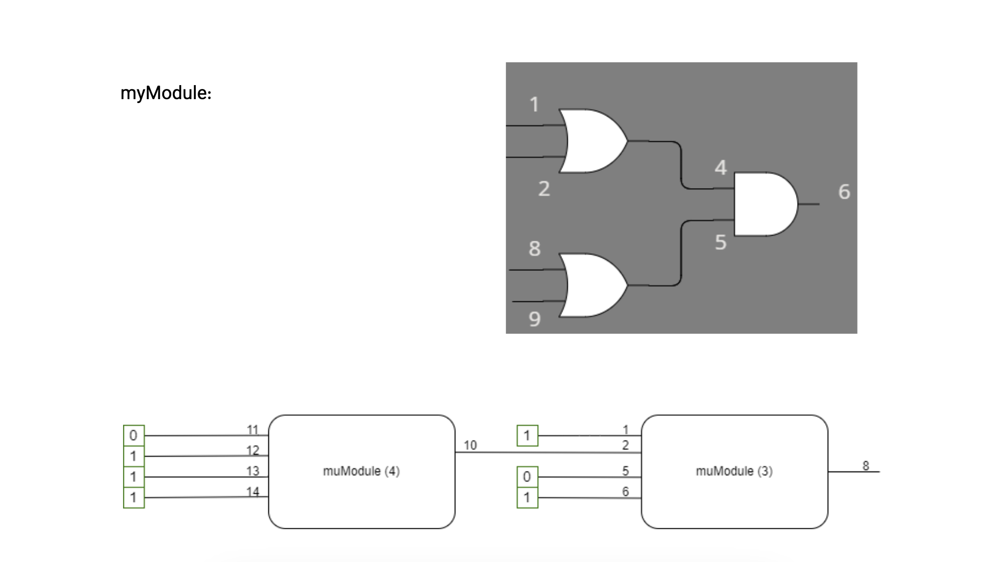

# Mini ModelSim Simulator in C++

## Project Overview

This project is a simplified version of a ModelSim simulator implemented in C++. The simulator is designed to model and simulate digital logic circuits using basic logic gates like AND, OR, NAND, NOR, and NOT. The simulator also supports the creation of modules, which are combinations of logic gates and inputs that can be instantiated and connected to form more complex circuits.

## Features

- **Basic Logic Gates**: Support for AND, OR, NAND, NOR, and NOT gates.
- **Custom Modules**: Create custom modules that combine multiple gates and inputs.
- **Error Handling**: Custom exceptions for handling bad inputs and missing components.
- **Wire Management**: Wires are used to connect gates and propagate logical values.
- **Simulation**: Resolve the output of a module based on the provided inputs and the connections between gates.

## Project Structure

- **`CommandManager`**: Handles user commands for creating modules, connecting gates, and printing results.
- **`BaseModule`**: An abstract class that provides the foundation for gates and modules. It handles inputs, outputs, and resolving logic.
- **`Gate`**: An abstract class derived from `BaseModule` that serves as the base for all logic gates. Specific gates like AND, OR, etc., inherit from this class.
- **`Wire`**: Represents a connection in the circuit, holding a logical value that can be `0`, `1`, `X` (unknown), or `Z` (high impedance).
- **`Module`**: Represents a combination of gates and inputs, allowing for the creation of complex digital circuits. Modules can be instantiated, connected, and resolved.

## Installation

1. **Clone the Repository**:
    ```bash
    git clone https://github.com/mehrawbmh/mini-modelsim.git
    cd mini-modelsim
    ```

2. **Compile the Project**:
    ```bash
    make
    ```

3. **Run the Simulator**:
    ```bash
    ./ModelSim.out
    ```

## Usage

### Example Circuit

The following is an example of how to define a module, instantiate it, connect inputs and outputs, and print the result:

```text
new_module myModule 4
add or 1 1 2 3
add or 2 8 9 7
connect in1 2
add and 3 4 5 6
connect 3 4
connect 7 5
connect in0 1
connect in2 8
connect in3 9
connect 6 out
end_module
add myModule 3 1 2 5 6 8
add myModule 4 11 12 13 14 10
connect 10 2
put 1 1
put 11 0
put 12 1
put 13 1
put 14 1
put 5 0
put 6 1
print 3
```



This script creates a module with OR and AND gates, instantiates it twice, connects various inputs and outputs, and prints the final result.

```text
final result: 1
```


### Command Reference

- **`new_module <name> <num_inputs>`**: Start defining a new module with a specified number of inputs.
- **`add <gate_type> <gate_id> <input_ids...> <output_id>`**: Add a gate of the specified type (e.g., `and`, `or`) to the module.
- **`connect <input_id> <gate_id>`**: Connect an input or output to a gate.
- **`end_module`**: Finish defining the current module.
- **`put <input_id> <value>`**: Set the value of a specific input.
- **`print <module_id>`**: Print the result of the specified module.

## Future Work

- **fix resolveing logic**: show true output while calling "print" command
- **XOR Gate**: Implement the XOR gate.
- **Module Import/Export**: Add functionality to save and load modules.
- **GUI**: Consider adding a graphical interface for easier circuit design.

## Contributing

Feel free to fork this project and submit pull requests. Any improvements, bug fixes, or new features are welcome!
